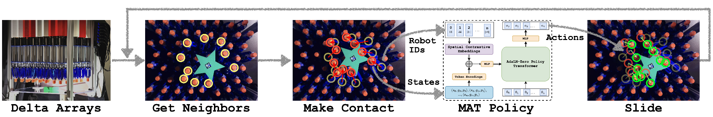

# Distributed Dexterous Manipulation with Spatially Conditioned Multi-Agent Transformers



This code release accompanies the following paper:
#### Distributed Dexterous Manipulation with Spatially Conditioned Multi-Agent Transformers
Anonymous Authors, under review for CoRL-2025

**Abstract**: Distributed Dexterous Manipulation (DDM) is a novel paradigm that presents significant control challenges due to high action-space redundancy, inter-robot cooperation, and dynamic object-robot interactions. This paper introduces a framework based on spatially conditioned Multi-Agent Transformers (MATs) to efficiently learn robust control policies for a DDM system grounded in an array of 64 soft delta robots arranged in an 8 × 8 grid. Our three core contributions are: (i) an MAT with adaptive layer norm for compute efficiency, (ii) spatial contrastive embeddings to ground transformer embeddings in the spatial configuration of the robots, and (iii) an MAT-based behavior cloning method fine-tuned using Soft Actor Critic. We also propose an action selection formulation to analyze the trade-off between task performance and the number of robots utilized. Our experiments show that MATs iteratively refine their actions through the stacked attention blocks. This further informs the benefit of spatial conditioning in transformers to learn DDM policies. We demonstrate long-horizon planar manipulation tasks with objects of various geometries in simulation and real-world. Finally, we
show how action selection mitigates robot maintenance by reducing wear and tear due to inter-robot collisions while maintaining the ability to manipulate objects along various trajectories in the real-world, achieving an average error of ∼1.5 cm, while using ∼65% fewer robots.

### Installation Instructions
#### Prerequisites
* Python 3.12
* conda or venv environment

#### Library Installation
* Toggle your conda or venv environment.
* (Optional) Lang-SAM is used for real world object segmentation and tracking. Can be installed by following [instructions here](https://github.com/paulguerrero/lang-sam).
* (Required) ```pip install -r requirements.txt``` will install everything in the correct order after that.


### To test all pretrained policies for quasi-static closed-loop object manipulation over all trajectories in MuJoCo:

In order to test pretrained policies, please download checkpoints using [this link](https://drive.google.com/drive/folders/1RVxcioztIdYit08ydpLEL_ixFUzfXj5I?usp=sharing) and store the ```.pt``` files in the ```pretrained_ckpts/``` folder. Then run:
> python test.py -nenv 1 -dontlog -test_traj -algo All -gauss -am AdaLN -devrl 0


### To train new policies in MuJoCo:

Pre-collected expert data using visual servoing should be downloaded to the ```data/``` folder using [this link](https://drive.google.com/file/d/1K5ZryU8wQ3N8lVHqwuW8L-OqbdbEhcb3/view?usp=sharing).

MATBC pretraining can be run using [MATBC Jupyter Notebook](utils/MATBC/MATBC.ipynb)

To run MATBC-FT-OG (Finetuning with original reward action selection):
>python main.py -nenv 8 -nruns 50 -rs 0.01 -wu 100000 -nupd 2000 -n matbc_ft_og_new -n2 matbc_pretrained -algo MATBC_FT -qlr 1e-4 -pilr 1e-4 -qetamin 1e-6 -pietamin 1e-6 -optim adamW -gn 2 -am AdaLN -gauss -devrl 0 -dontlog

To run MATBC-FT-DEC (Finetuning with Discrete Execution Cost):
>python main.py -nenv 8 -nruns 50 -rs 0.01 -wu 100000 -nupd 2000 -n matbc_ft_dec_new -n2 matbc_pretrained -algo MATBC_FT -qlr 1e-4 -pilr 1e-4 -qetamin 1e-6 -pietamin 1e-6 -optim adamW -gn 2 -am AdaLN -gauss -devrl 0 -dec -dontlog

To run MATBC-FT-CEC (Finetuning with Continuous Execution Cost):
>python main.py -nenv 8 -nruns 50 -rs 0.01 -wu 100000 -nupd 2000 -n matbc_ft_cec_new -n2 matbc_pretrained -algo MATBC_FT -qlr 1e-4 -pilr 1e-4 -qetamin 1e-6 -pietamin 1e-6 -optim adamW -gn 2 -am AdaLN -gauss -devrl 0 -cec -dontlog

To run MATBC-FT-MEC (Finetuning with Merged Execution Cost):
>python main.py -nenv 8 -nruns 50 -rs 0.01 -wu 100000 -nupd 2000 -n matbc_ft_mec_new -n2 matbc_pretrained -algo MATBC_FT -qlr 1e-4 -pilr 1e-4 -qetamin 1e-6 -pietamin 1e-6 -optim adamW -gn 2 -am AdaLN -gauss -devrl 0 -dec -cec -dontlog

MATSAC can be trained from scratch using only 2D (XY) actions (as used for comparison in the paper):
>python main.py -nenv 8 -nruns 50 -rs 0.01 -wu 100000 -nupd 2000 -n matsac_new -algo MATSAC -qlr 1e-4 -pilr 1e-4 -qetamin 1e-6 -pietamin 1e-6 -optim adamW -gn 2 -am AdaLN -gauss -devrl 0 -dontlog

Action selection args ```-dec``` or ```-cec``` can be added to enable Z-axis actions. To enable wandb logging, please remove ```-dontlog```

### Real world inference
Real world planar manipulation code for trajectory tracking and video capture can be found in [main_real.py](main_real.py). 